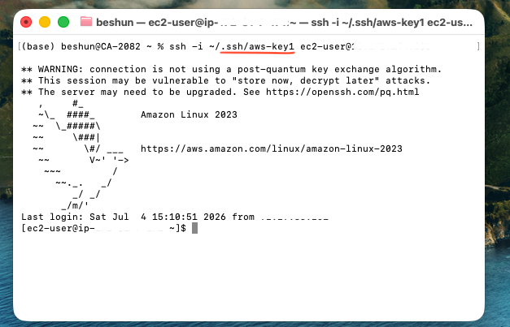
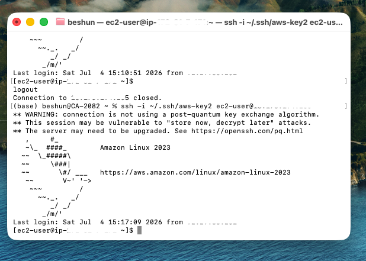
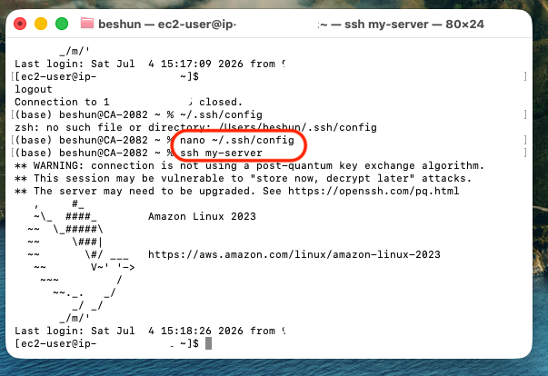
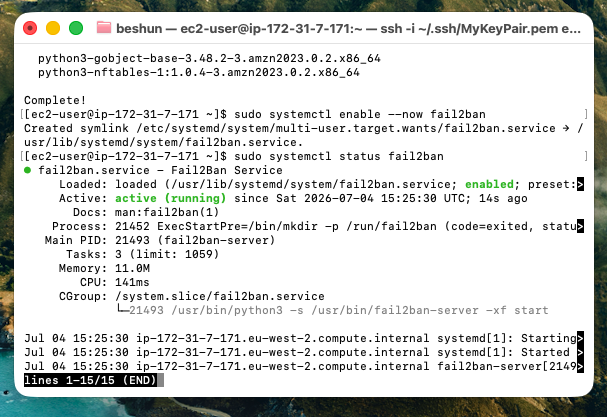

# :rocket: SSH Remote Server Setup

Project Reference: https://roadmap.sh/projects/ssh-remote-server-setup

## :book: Overview

This project demonstrates how to configure a secure remote Linux server on AWS using SSH key-based authentication.

The project covers:


Launching an AWS EC2 instance
Creating multiple SSH key pairs
Connecting securely from macOS Terminal
Installing and configuring the OpenSSH server
Disabling password authentication
Configuring Fail2Ban to protect against brute-force attacks
Testing multiple SSH keys


---

# :dart: Project Goal

The objective of this project was to learn Linux server administration and secure remote access using SSH.

Skills learned:


AWS EC2 provisioning
Linux server administration
SSH authentication
SSH key management
Server security best practices
Fail2Ban configuration


---

# :desktop_computer: Environment

| Item | Details |
|-------|----------|
| Cloud Provider | AWS EC2 |
| Operating System | Amazon Linux 2023 |
| Instance Type | t3.micro (Free Tier) |
| Local Machine | macOS |
| Terminal | macOS Terminal |
| Authentication | SSH Key Authentication |

---

# :white_check_mark: Project Requirements Completed


:white_check_mark: Created an EC2 instance
:white_check_mark: Generated two SSH key pairs
:white_check_mark: Added both public keys to the server
:white_check_mark: Successfully connected using SSH Key 1
:white_check_mark: Successfully connected using SSH Key 2
:white_check_mark: Installed OpenSSH Server
:white_check_mark: Enabled SSH service
:white_check_mark: Installed Fail2Ban
:white_check_mark: Verified Fail2Ban is running


---

# Step 1 - Launch AWS EC2 Instance

Created an Amazon Linux 2023 EC2 instance from the AWS Console.

Instance Details:


Amazon Linux 2023
t3.micro
SSH access enabled
Security Group allowing port 22

---

# Step 2 - Create SSH Keys

Generated two SSH key pairs locally using macOS Terminal.

### SSH Key 1

```bash
ssh-keygen -t ed25519 -C "ssh-key-1" -f ~/.ssh/aws-key1 -N ""
```

### SSH Key 2

```bash
ssh-keygen -t ed25519 -C "ssh-key-2" -f ~/.ssh/aws-key2 -N ""
```

Both keys were stored inside:

```bash
~/.ssh/
```

Example:

```
id_ed25519_key1
id_ed25519_key1.pub

id_ed25519_key2
id_ed25519_key2.pub
```

---

# Step 3 - Copy Public Keys to the Server

Copied both public keys into the server's authorized_keys file.

Example:

```bash
cat ~/.ssh/id_ed25519_key1.pub
```

Then appended the public key to:

```bash
~/.ssh/authorized_keys
```

Repeated the process for Key 2.

---

# Step 4 - Connect Using SSH Key 1

Connected successfully from macOS Terminal.

Command:

```bash
ssh -i ~/.ssh/id_ed25519_key1 ec2-user@<EC2-PUBLIC-IP>
```

:camera: Screenshot



---

# Step 5 - Connect Using SSH Key 2

Verified that the second key also works.

Command:

```bash
ssh -i ~/.ssh/id_ed25519_key2 ec2-user@<EC2-PUBLIC-IP>
```

:camera: Screenshot



---

# Step 6 - Install OpenSSH Server

Updated the server.

```bash
sudo dnf update -y
```

Installed OpenSSH Server.

```bash
nano ~/.ssh/config
```

Enabled SSH.

```bash

Host my-server

HostName YOUR-PUBLIC-IP

User ec2-user

IdentityFile ~/.ssh/aws-key1
```

Connect with alias

```bash
ssh my-server
```

:camera: Screenshot



---

# Step 7 - Install Fail2Ban

Installed the EPEL repository (if required).

```bash
sudo dnf install epel-release -y
```

Installed Fail2Ban.

```bash
sudo dnf install -y fail2ban
```

Enabled the service.

```bash
sudo systemctl enable --now fail2ban
```

Verified Fail2Ban status.

```bash
sudo systemctl status fail2ban
```

:camera: Screenshot



---

# Step 8 - Verify SSH Access

Confirmed that both SSH keys authenticate successfully.

SSH Key 1:

```bash
ssh -i ~/.ssh/id_ed25519_key1 ec2-user@<EC2-PUBLIC-IP>
```

SSH Key 2:

```bash
ssh -i ~/.ssh/id_ed25519_key2 ec2-user@<EC2-PUBLIC-IP>
```

Both logins were successful.

---

# :books: What I Learned

Through this project I learned how to:


Provision an AWS EC2 instance
Secure a Linux server using SSH keys
Manage multiple SSH identities
Connect securely from macOS Terminal
Install and manage system services
Protect a server against brute-force attacks using Fail2Ban
Follow Linux security best practices


---

# :checkered_flag: Project Status

:white_check_mark: Completed
